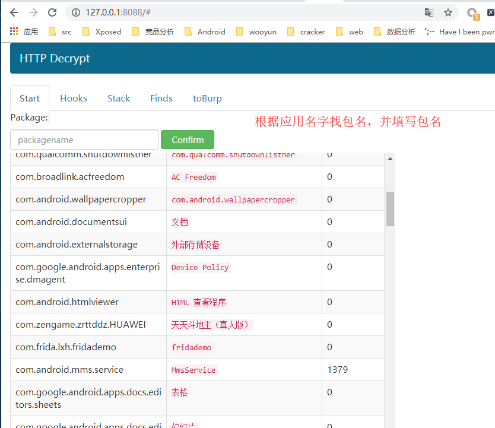
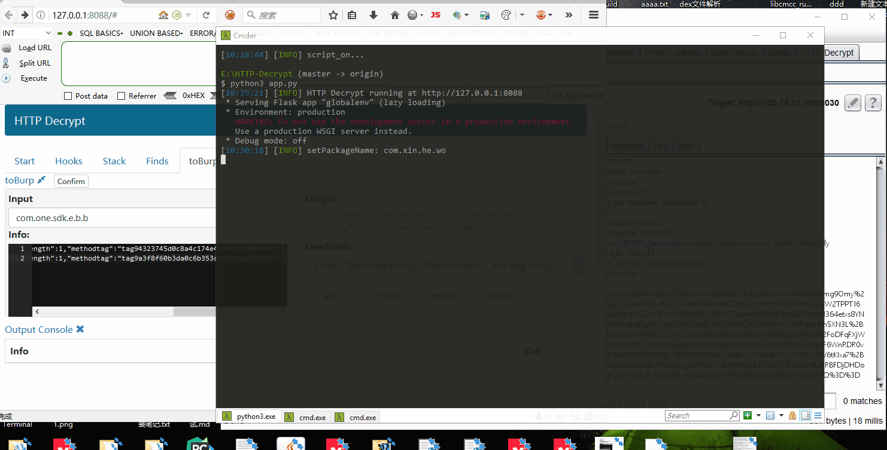

# HTTP Decrypt

利用HTTP协议 远程加解密数据包，实现Burp一条龙服务。


env:
python3
frida
Burp
flask


## 使用方式

运行


不指定端口直接运行则为默认端口，

1. python3 app.py
2. Android_frida_server 运行
3. 转发frida端口。 
4. 打开HTTP Decrypt页面，如果在Start界面出现应用包名列表信息则可正常使用其他功能，如果不行，刷新一下看看控制台出现的信息。




### Hooks
填写字符串，将类名与你填写的字符串匹配，并Hooks类下的所有方法，hook多个类名，回车换行。


### Stack
Hooks打印的堆栈会在这里显示。


### Finds
根据字符串，查找类，匹配到类，将类下的方法都打印出来。多个查找回车换行继续写。提供了过滤机制。


### toBurp

#### 对称加解密

通过xxx方式得到了通信协议加解密函数。如下例子中的：
```
com.one.sdk.e.b.a   encrypt
com.one.sdk.e.b.b   decrypt 
```


选择完成后，点击Export。


效果：


在可编辑区域调用的是Request function 1,2，不可编辑区域调用的是response function3 ,4

打开Auto后，Burp Scanner ，Intruder模块 也可以使用。
Auto功能 数据包加密调用的是 Request function 1，数据包解密调用的Request function 2。

#### 签名


某APP数字签名算法如下：
字符串  "prod_secret123@muc" +整个 body + HTTP头 random字段;
签名值放在HTTP头中的sign字段。使用md532位加密，配置如下。


效果：


### toBurp-hook (配合export使用)
调用APP内的方法

hook之后会有call按钮，如果想使用，请点击export按钮之后再使用。
效果如下：


Note:也可以直接在POST修改，但是需要解码一次，比较麻烦，因此直接选择Change body encoding,然后进行修改，效果一样的。

### toBurp-toBurp
拦截指定函数，修改参数or返回值，再返回给应用程序。
复杂数据类型仅支持修改一维数组。


### future
1. 支持IOS，（老板说配IOS测试机 配了几个月了 还没到手。）
2. toBurp-toBurp 增加栈。
3. 还没想好。
